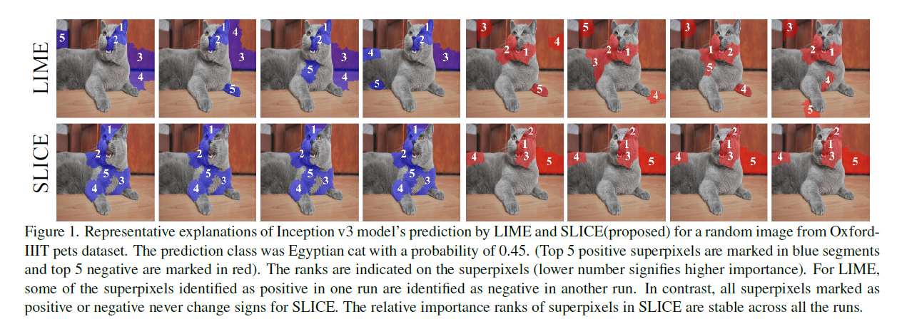

# SLICE: Stabilized LIME for Consistent Explanations for Image Classification

Code for the paper published in CVPR 2024 (Highlight).

Steps:
1) Install required packages
2) run slice_test.py

In slice_test.py the explaner is run multiple time to check the consistency at each run but ideally this explainer can be run once.

Disclaimer: The code was written for tensorflow

##Citation

If you use this code, please cite the following paper:

@InProceedings{Bora_2024_CVPR,
    author    = {Bora, Revoti Prasad and Terh\"orst, Philipp and Veldhuis, Raymond and Ramachandra, Raghavendra and Raja, Kiran},
    title     = {SLICE: Stabilized LIME for Consistent Explanations for Image Classification},
    booktitle = {Proceedings of the IEEE/CVF Conference on Computer Vision and Pattern Recognition (CVPR)},
    month     = {June},
    year      = {2024},
    pages     = {10988-10996}
}
