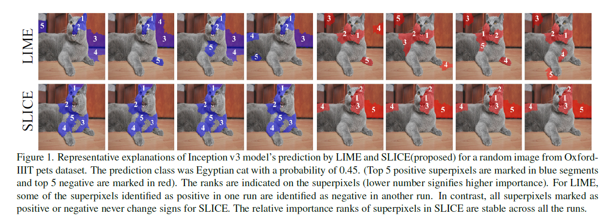

# SLICE: Stabilized LIME for Consistent Explanations for Image Classification
by Revoti Prasad Bora, Philipp Terhörst, Raymond Veldhuis, Raghavendra Ramachandra, Kiran Raja

Code for our paper published in CVPR 2024 (Highlight).

Steps:
1) Install required packages
2) run slice_test.py: This gives the explanations and populates the results directory
3) run fidelity_20runs.py to compute the fidelity scores using the pickle files from results directory and store the results in fidelity_results directory
4) run fidelity_plots.py to make plots for visualization using the pickle files form fidelity results directory

Directory Structure:
1)the results directory should have the following sub-directories: oxpets and pvoc. Each of these should have subdirectories with pattern explanationtechnique_modelname (i.e. lime_resnet50)
2) The fidelity_results directory should have the following sub-directories: aopc_ins, aopc_del, ins, del
In slice_test.py the explaner is run multiple time to check the consistency at each run but ideally this explainer can be run once.

Disclaimer: The code was written for tensorflow and for each subsequent file to run the directory names and filenames should follow the convention as stated in "Directory Structure"

## Citation

If you use this code, please cite the following paper:

@InProceedings{Bora_2024_CVPR,
    author    = {Bora, Revoti Prasad and Terh\"orst, Philipp and Veldhuis, Raymond and Ramachandra, Raghavendra and Raja, Kiran},
    title     = {SLICE: Stabilized LIME for Consistent Explanations for Image Classification},
    booktitle = {Proceedings of the IEEE/CVF Conference on Computer Vision and Pattern Recognition (CVPR)},
    month     = {June},
    year      = {2024},
    pages     = {10988-10996}
}
